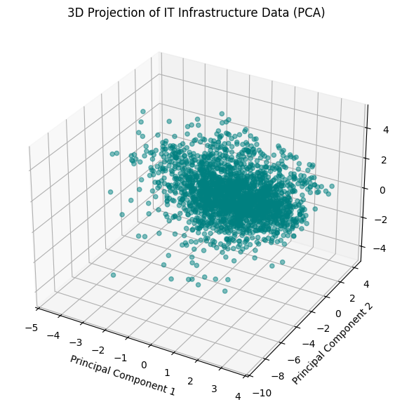
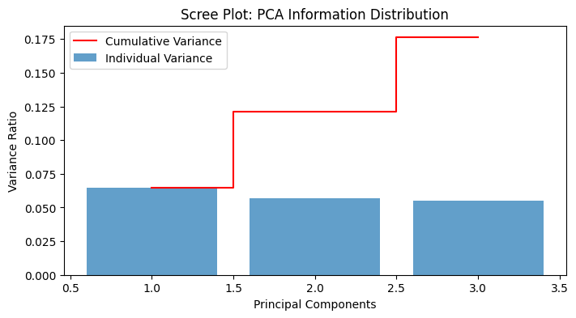
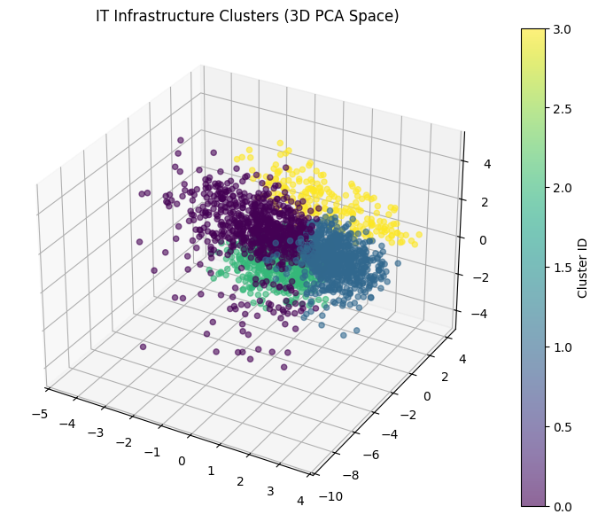

# IT Infrastructure Cost Optimization (ITFM)

### **Overview**
This project applies **Unsupervised Machine Learning** to IT Financial Management (ITFM). By clustering IT assets and department spending patterns, we identify "Ghost Resources" and "Inefficiency Clusters" that traditional rule-based reporting often misses.

### **The Problem**
Enterprise IT environments are often "black boxes." Departments over-provision cloud resources to avoid performance bottlenecks, leading to massive financial waste. 

### **The Solution (The Pipeline)**
1.  **Data Engineering:** Synthesis of a 30-feature dataset with intentional "dirty" data (outliers, missing values) to simulate real-world messiness.
2.  **Dimensionality Reduction:** Utilizing **PCA** to compress 30 variables into 3 Principal Components.
3.  **Clustering:** Applying **Agglomerative Clustering** to group assets by behavior rather than just cost.
4.  **Financial Impact:** Identifying clusters with <15% utilization but high spend.

### **Key Results**
* **Identified Annual Savings:** Over **$500,000** in recoverable OpEx.
* **Efficiency Gains:** 20% potential reduction in total IT overhead through "Right-Sizing."
* **Strategy:** Implementation of a "Tag-or-Terminate" policy for zombie assets.

## Technology Stack

* **Language:** Python 3.x
* **Data Manipulation:** `Pandas`, `NumPy` (Handling 2.5k+ infrastructure snapshots)
* **Machine Learning:** `Scikit-Learn`
    * **PCA:** Dimensionality reduction from 30+ features to 3 principal components.
    * **Agglomerative Clustering:** Hierarchical grouping for nested cost patterns.
* **Visualization:** `Matplotlib`, `Seaborn` (3D Projection and Variance plots)
* **Environment:** Jupyter Notebook / VS Code


## 📂 Project Structure
```text
├── data/
│   ├── itfm_raw_dirty_data.csv        # Simulated "messy" IT logs
│   └── itfm_cleaned_and_clustered.csv # Processed data with ML labels
├── images/                            # Plots and visualizations
├── itfm.ipynb                         # Main analysis notebook
├── requirements.txt                   # Dependency list
└── .gitignore                         # Metadata exclusion
```

### **How to Run**
1. Clone the repo.
2. Install dependencies: `pip install -r requirements.txt`
3. Open `shg_itfm.ipynb` in Jupyter Notebook or VS Code.


## Data Visualizations & ML Pipeline

### Step 1: Data Engineering & Cleaning
The initial dataset simulates "real-world messiness," including missing values and inconsistent scaling across 30+ features.

- Handling "Dirty" Data: Implemented automated cleaning to handle null values in utilization logs and removed non-predictive features like Asset_ID.
- Standardization: Used StandardScaler to normalize features. This ensures that a $5,000 Monthly_Spend doesn't mathematically outweigh a 99% Uptime_Percentage during model training.

### Step 2: PCA & Dimensionality Reduction
To handle the "Curse of Dimensionality," the project employs Principal Component Analysis (PCA).

- Compression: 30+ infrastructure variables (CPU, RAM, Age, License Fees, etc.) are compressed into 3 Principal Components.
- Spatial Mapping: This allows us to map every IT asset into a 3D coordinate system, making hidden patterns visible to the human eye.



### Step 2.1: Variance Analysis
Before proceeding to clustering, we validate the PCA performance.

- Information Retention: By analyzing the Explained Variance Ratio, we confirmed that our 3 components capture the vast majority of the dataset's "signal."
- Elbow Plotting: This step ensures that the reduction simplifies the data without losing the critical nuances that define "wasteful" vs. "efficient" behavior.



### Step 3: Clustering & Profiling
Using the PCA-transformed data, we apply Agglomerative Clustering to group assets into distinct "Infrastructure Archetypes."

- Hierarchical Grouping: Unlike simple filtering, this identifies nested patterns (e.g., assets that have high costs and low usage and are over 3 years old).
- Persona Mapping: Clusters are translated into business personas:
- "Ghost Resources": Zero-utilization assets.
- "The Over-Provisioners": High-spec machines running idle workloads.
- "Legacy Debt": Older assets with skyrocketing maintenance costs.



### Step 4: Strategic ROI Analysis
The final step moves from data science back to financial management.

- Waste Quantification: The pipeline calculates the total "Financial Footprint" of the identified waste clusters.
- The 20% Rule: By applying a conservative "Right-Sizing" factor (20% reduction) to inefficient clusters, the model projects a recoverable OpEx of over $500,000 annually.
- Policy Generation: Provides a foundation for a "Tag-or-Terminate" governance policy to prevent future resource creep.


